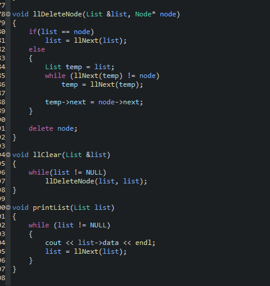

# EclipseThemeDarkPlus
The best approximation of Dark+ Syntax highlight for VS Code adapted on Eclipse CDT.

I use this with darkest dark theme on marketplace: https://marketplace.eclipse.org/content/darkest-dark-theme-devstyle (I TOTALLY DONT OWN THE THEME), but it should work good with every grey/dark theme.
I only made the syntax highlight prefs.

Put both files in {Eclipse workspace directory}/.metadata/.plugins/org.eclipse.core.runtime/.settings/, deleting the existing one.

#### Preview in Eclipse

